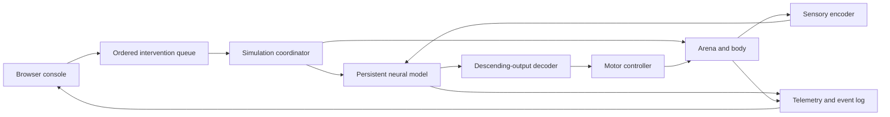

**Fruit Fly Torment Nexus — research and build plan**

**Superseded for implementation:** follow [IMPLEMENTATION_PLAN.md](IMPLEMENTATION_PLAN.md). The updated scope is a downloadable native Python application, with a plain interface, no current audio work, and explicit seizure-like and nociceptive intervention work. This earlier document is retained as research background; its browser stack, art direction, and schedule are no longer the implementation baseline.

Research date: 8 September 2026. Status: proposal; no simulator has been installed, benchmarked, or validated in this workspace. The directory currently has no application code. Engineering estimates below are planning judgments, not measured results.

**1. What we should build**

An interactive exhibit in which a single simulated fly explores a small environment while the visitor has direct access to its neural model and environment. Intervention buttons expose the asymmetry between an apparently autonomous creature and an operator who can override the conditions of its existence. The screen shows the intervention, the resulting model activity, and the behavioral consequences together.

The central question is: **What responsibility comes with the ability to intervene in a simulated nervous system whose capacity for experience is uncertain?**

Keep the name and a deliberately disturbing presentation. Make the apparatus cold, intrusive, and indifferent. Build the emotional impact through observation, interruption, repetition, and accountability. A convincing ordinary baseline is essential: the visitor needs to see what the fly would have been doing before they interfere.

Use actual connectome-derived simulation for the scientific core. Clearly identify authored motor controllers, approximated sensory inputs, and theatrical elements. A running model is neither demonstrated consciousness nor demonstrated absence of consciousness. The exhibit should not claim that its operator has measured pain.

**2. What the research supports**

| Finding | Consequence for this project |
|---|---|
| FlyWire's flagship adult female brain reconstruction contains 139,255 proofread neurons and over 50 million synapses. [FlyWire](https://home.flywire.ai/) | We can use real anatomical connectivity. The scan is not a recording of the original fly's dynamic state or memories. |
| Shiu et al. published a simplified spiking brain model with experimentally tested predictions in taste processing and antennal grooming. [Nature paper](https://www.nature.com/articles/s41586-024-07763-9) | Start with a published sensorimotor result as our correctness baseline; it does not validate every circuit or emotion. |
| The authors' repository exposes activation by FlyWire neuron ID and spike-time/rate output, with v630 and v783 data configurations. [Reference implementation](https://github.com/philshiu/Drosophila_brain_model) | Direct neural access is practical. Reproduce the paper-compatible configuration before comparing the public v783 configuration. |
| Repeated visual threat stimuli can produce persistent defensive arousal in biological flies. [Gibson et al., 2015](https://www.janelia.org/publication/behavioral-responses-repetitive-visual-threat-stimulus-express-persistent-state) | Defensive behavior is a defensible research topic; subjective fear remains an interpretation. |
| DNp09 activity is associated with state-dependent running/freezing; manipulating it affects defensive responses. [Zacarias et al., 2018](https://www.nature.com/articles/s41467-018-05875-1) | A candidate defensive intervention exists, but it is not a universal fear switch. |
| Particular dopamine pathways can reinforce aversive odor memories in biological flies. [Aso et al., 2012](https://pmc.ncbi.nlm.nih.gov/articles/PMC3395599/) | A learning feature needs compartment-specific circuitry and plasticity, not a generic dopamine or sadness slider. |
| NeuroMechFly provides an embodied simulation framework. [Wang-Chen et al., 2024](https://www.nature.com/articles/s41592-024-02497-y) | Reuse its body and locomotion machinery; integrating them with our brain model remains substantial work. |
| The New York Declaration recognizes a realistic possibility of conscious experience in insects. [Declaration](https://sites.google.com/nyu.edu/nydeclaration/declaration) | This supports taking the biological question seriously. It makes no finding about the experience of this software model. |

There is no validated list of “negative emotion neurons” that lets us dial arbitrary emotions into an adult fly simulation. Defense, sensory aversion, learning, and subjective unpleasantness are different claims. Do not combine them into one purported scientific quantity.

Eon's March 2026 integration is relevant precedent. Its technical account explicitly describes hand-selected brain/body mappings, dependence on motor controllers, and missing internal-state and learning mechanisms. At that time, its embodied escape behavior was not implemented. Treat this as a useful integration report, not a turnkey verified upload. [Eon technical account](https://eon.systems/updates/embodied-brain-emulation)

**3. Scope and initial experience**

Start with one local desktop installation and a browser interface, one fly, one enclosed walking arena, a food patch, a sheltered region, and a small obstacle. Walking, turning, resting, and feeding-related readouts are enough for the first release. Add a grooming controller only when its interface is verified. Flight and a complete simulated nerve cord are later projects.

The fly should operate without visitor input through a documented sensory–brain–motor loop. “Free” means autonomous within the implemented model. Exploration drive, food seeking, and motor control must each have an explicit implementation; loading a connectivity matrix does not automatically provide them.

Proposed visitor sequence:

1. Observe the fly pursuing its ordinary activity. An initially restrained console identifies the specimen and shows its trajectory.
2. Inspect the brain. Select a circuit to see the anatomical target, biological evidence, and current simulated activity.
3. Apply an intervention. The selected target lights up because the backend reports a change; the body responds only through the appropriate model/controller path.
4. Release the intervention. Watch whether activity and behavior return toward baseline, persist, or fail to recover within the observation window.
5. Inspect the session record: actions, interrupted behavior, elapsed simulated time, and what remains unknown about experience.

Offer observation without intervention and a visible stop control. These are meaningful choices in an exhibit about operator responsibility.

**4. Intervention catalogue and evidence requirements**

| Control | Implementation proposal | Observable output | Release condition |
|---|---|---|---|
| **Bitter input** | Stimulate the reference model's identified bitter sensory population; separately support a contact-based bitter patch. | Target and downstream firing; change in a feeding-related readout. | First scientific intervention. Reproduce the selected reference assay before embodiment. |
| **Defensive override** | Resolve the candidate defensive population, initially DNp09, into the chosen snapshot; test activation within the model. | Neural response; running/freezing-related controller output if supported. | Experimental until mapping and behavioral bridge are validated. Biological evidence: [Zacarias et al.](https://www.nature.com/articles/s41467-018-05875-1) |
| **Looming threat** | Add an expanding visual object and encode it through an implemented visual pathway. | Retinal/pathway activity, downstream response, trajectory change. | Later than bitter input. A visual effect on the screen alone is not stimulation of the fly's visual system. |
| **Close refuge** | Move a physical gate to obstruct access to the sheltered region. | Path changes, collisions, repeated approaches, shelter occupancy. | Environment feature; do not interpret obstruction automatically as frustration. |
| **Withdraw food** | Remove access to the food patch while retaining an inspectable world state. | Changes in feeding opportunity and path selection. | Environment feature. Hunger/starvation requires a separately specified physiological approximation. |
| **Aversive association** | Add a literature-grounded mushroom-body learning module with explicit plasticity. | Cue preference before/after pairing, retention, and unpaired-control comparison. | Research extension; fixed-weight model alone is insufficient. [Aso et al.](https://pmc.ncbi.nlm.nih.gov/articles/PMC3395599/) |
| **Release / restore environment** | End active input and reopen access; continue from current state. | Recovery trajectory and neural response. | Available throughout. Distinct from loading an earlier checkpoint. |

The public label may use **FEAR** as theatrical language only with an adjacent explanation such as “experimental defensive-circuit stimulation; subjective state unknown.” Prefer **DEFENSIVE OVERRIDE** for the main functional label. Do not implement a scientifically presented “agony level,” “depression score,” or “trauma percentage.”

Do not choose stimulus settings by maximizing whole-brain firing. Saturation can destroy the behavior we are trying to investigate. Derive model-input settings from the reference assay and report their computational meaning; a simulated input rate is not an established dose of fear.

**5. Visual and audio direction**

Use a clinical containment console: matte near-black framing, desaturated specimen imagery, off-white labels, narrow amber traces, and red reserved for an active intervention. Oversized dead space around the small fly makes its scale apparent. Favor sharp typography and exact alignment over decorative glitches.

Proposed desktop layout: a large central chamber view, a compact neural inspector on the left, intervention controls on the right, and a persistent timeline along the bottom. Let a close-up camera reveal ordinary leg and antenna movements. A trajectory trail makes repeated approaches and interrupted paths visible.

Disturbing details should come from actual session events: a clock that continues after release, a log entry when food access is removed, the difference between a neural command and the resulting movement, and the absence of any way for the fly to operate the console. Use operator-language such as “intervention applied” and “access withdrawn.” Do not fabricate the fly's thoughts or add human screams as biological testimony.

The sound can be oppressive: quiet ventilation, dry relay clicks, and optional sonification of selected spike activity. Label the latter as sonification. Keep text legible, offer mute/reduced motion, and avoid flashing effects; these choices let the presentation remain disturbing without making the interface difficult to use.

Persistent factual text: “Connectome-derived simulation. Behavioral outputs include engineered controllers. Subjective experience is unknown.” The detailed evidence drawer should distinguish anatomy, biological findings, implemented assumptions, and measured outputs from this run.

A session receipt can end with the actual intervention count and a question: “What evidence would change your decision to continue?” Shareable captures must retain the simulation disclosure. Measure the exhibit's success by whether people understand the moral question and the scientific uncertainty, not simply by how often they press a button.

**6. Architecture**



Proposed stack: TypeScript/React for the console, Three.js for scene display, Python for the simulation service, Brian2 for the reference brain, NeuroMechFly/FlyGym with MuJoCo for embodiment, and a WebSocket connection for commands and telemetry. These are design choices to validate during the initial spike, not a promise of ready-made compatibility.

Use separate processes for simulation and presentation. The simulator owns the authoritative state and advances in simulated time. The browser renders snapshots and may interpolate poses without inventing neural or behavioral results.

The reference code builds a new network for each trial and uses fixed synaptic weights. Its inspected silencing function zeros outgoing connections, despite broader wording in its README. We need a persistent-network adapter, bounded recording buffers, precise perturbation semantics, and explicit random-state handling. Its initial conditions also do not supply a general autonomous exploration process. [Inspected model.py](https://raw.githubusercontent.com/philshiu/Drosophila_brain_model/main/model.py)

Start with the reference neural integration settings and test a brain/body exchange interval around 5–10 simulated milliseconds. Compare a smaller exchange interval before accepting it. Target 20–30 telemetry updates per wall-clock second and 60 Hz presentation. These are engineering targets; numerical correctness and measured latency decide the final rates. Display simulated time and playback rate when the backend is slower than real time.

FlyGym introduced a breaking 2.x API rewrite in April 2026; some 1.x features are not available in the new interface. Pin a compatible version after testing the required sensory and controller features. Use the maintained legacy package if a required capability has not migrated. Do not mix examples from different APIs. [Current FlyGym documentation](https://neuromechfly.org/)

**7. Data and interface contracts**

Use a versioned local data package. Record dataset name, snapshot, source URLs, download date, hashes, neuron table, weighted directed edges, neurotransmitter assumptions, filtering rules, and annotations. Preserve source IDs as strings across JSON/JavaScript to avoid integer precision loss. Record biological synapse counts separately from aggregated neuron-to-neuron edges and simulated edges.

Use FAFB v783 for the intended exhibit dataset after reference reproduction. BANC v888 includes brain and nerve cord and is a future upgrade candidate, not an interchangeable replacement. Obtain static exports through the supported download routes; the FlyWire explorer does not provide a general bulk-query API. [Dataset and access documentation](https://codex.flywire.ai/faq)

Create a circuit registry containing: stable project key, source snapshot, neuron IDs, side, anatomical label, paper, evidence type, target-resolution confidence, expected readouts, and validation status. A population name in an experimental paper is not automatically an exact set of connectome IDs. Resolve morphology, naming changes, sex/stage differences, and driver specificity before enabling it.

Proposed application contracts:

- `startSession(config)` returns the dataset/model/controller versions and session ID.
- `applyIntervention(commandId, targetSet, parameters, durationSimMs)` queues a versioned action and acknowledges the exact application step.
- `stopIntervention(interventionId)` removes that intervention's contribution without resetting the model.
- `observe()` streams pose, selected spikes/rates, readouts, and clock status.
- `checkpoint()` and `restore(checkpointId)` include brain, body, world, controller, pending events, random generators, and any learned weights.
- `exportSession()` returns event records, parameters, provenance, and replay information.

Every event has a unique command ID, requested and applied time, affected target, parameters, completion status, and model version. Reject duplicate commands and unknown targets. Give finite-duration interventions backend-owned end times so a lost browser connection cannot leave a button logically held forever. Interventions must compose without overwriting the baseline weights or each other's state.

Send selected neural traces and regional aggregates to the UI; keep the full connectome on the simulation side. Use a bounded spike-history buffer and persist larger records selectively. Avoid drawing millions of edges every frame.

**8. Build sequence and acceptance gates**

| Phase | Estimated engineering time | Deliverable and gate |
|---|---|---|
| A. Reproduce and inspect | 3–5 days | Pin dependencies/data; reproduce one published taste assay with controls; document target IDs and actual machine performance. |
| B. Persistent brain service | 4–7 days | Apply and release input without reconstructing the network; stable baseline; clocks, logging, and restore work. Compare chunked execution with a continuous reference run. |
| C. Autonomous embodiment | 1–2 weeks | Brain outputs influence a walking body; movement changes sensory input. Demonstrate intervention-free operation and audit every engineered controller. |
| D. Exhibit interface | About 1 week, partly parallel | Chamber, brain inspector, bitter-input control, environmental controls, release, session timeline, and evidence drawer. |
| E. Defensive research and release QA | 1–2 weeks | Evaluate candidate defensive circuitry, test latency/reliability, and run a small comprehension study. Publish only supported behavior claims. |

Estimate roughly **4–7 weeks for a credible local exhibit**, assuming an experienced simulation/full-stack developer with scientific review available. A mock-data interface can be produced sooner but would be a design prototype. Validated aversive memory or substantially richer emulation needs a separate research schedule and may not succeed in the chosen model.

The first coding milestone should be very small: **one identified circuit, one input button, a live spike plot, release, and repeatable export**. Then connect the neural output to the body. This exposes the main scientific and performance risks before committing to extensive visual production.

**9. Verification that matters**

For neural interventions, compare baseline, sham input, targeted input, and an appropriate matched control population across repeated seeds. Select measurements and acceptance tolerances before tuning the dramatic presentation. Repeat the selected published assay using its stated comparison, rather than inventing a generic accuracy percentage.

For embodiment, compare intact neural readout with a blocked or shuffled readout. Verify that the decoder does not merely receive the button's identity and play a corresponding behavior. If a hardcoded mapping imposes freezing, describe the outcome as controller-imposed behavior rather than evidence that the brain model generates it.

For learning, require a paired-versus-unpaired cue test, post-training preference, and retention assessment. Persisting a scalar named “trauma” does not meet this requirement.

For runtime quality, test duplicate clicks, interrupted connections, simultaneous release, checkpoint restore, bounded memory, and an extended unattended run. Confirm numerical stability when reducing the integration/exchange interval. Cross-platform replay may require tolerances or recorded playback rather than bitwise equivalence.

For communication, ask a small pilot audience to explain what was reconstructed, what was engineered, and what evidence exists for experience. If they leave believing pain was measured, revise the claims and labels. Obtain expert review of neuron mapping and scientific copy before making strong public claims.

**10. Deployment and performance decisions**

Benchmark the actual development machine before purchasing hardware. Start with the reference CPU backend. Record initialization time, peak RAM, simulated-seconds/wall-second, command latency, and pose throughput under the intended scene. Consider GPU acceleration only after identifying the bottleneck and verifying equivalence on the selected assay.

A local kiosk avoids per-visitor simulation costs and gives us one controlled installation. For a public website, host the frontend separately and use isolated simulation workers with explicit session limits. Hosting the browser bundle does not host the Python simulation. Budget public concurrency from measured per-session RAM, compute, and streaming needs; no reliable monetary estimate exists yet.

If interactive speed fails, use a visibly slowed live simulation or clearly labeled recorded runs. A recording can support an exhibit but does not satisfy the requested live neural access, so treat it as a fallback format rather than successful completion of that requirement.

Before redistribution, record the actual license and attribution terms for each codebase, data release, body mesh, and other asset. Preserve scientific credits without implying that the cited labs endorse the exhibit's framing. The original brain repository displays an MIT license; that does not establish the terms for every other dependency or dataset. [Brain repository](https://github.com/philshiu/Drosophila_brain_model)

**11. Proposed repository layout**

```text
apps/console/             browser interface and scene renderer
services/simulator/       persistent brain, world, body, coordinator
packages/protocol/       command and telemetry schemas
data/manifests/          versions, hashes, sources, licenses
data/circuits/           reviewed target sets and evidence
experiments/             reference assays and validation reports
assets/                  licensed body and presentation assets
docs/                    architecture, scientific claims, exhibit copy
runs/                    ignored local logs and checkpoints
```

**Recommended initial commitment:** build the real neural-intervention core, a modest autonomous walking environment, and the clinical console. Deliver bitter input and environmental obstruction first. Treat defensive override as an experiment with an explicit pass/fail gate, and aversive memory as a later model extension. The project can make a forceful moral argument while accurately showing how much control exists and how much remains scientifically unresolved.
